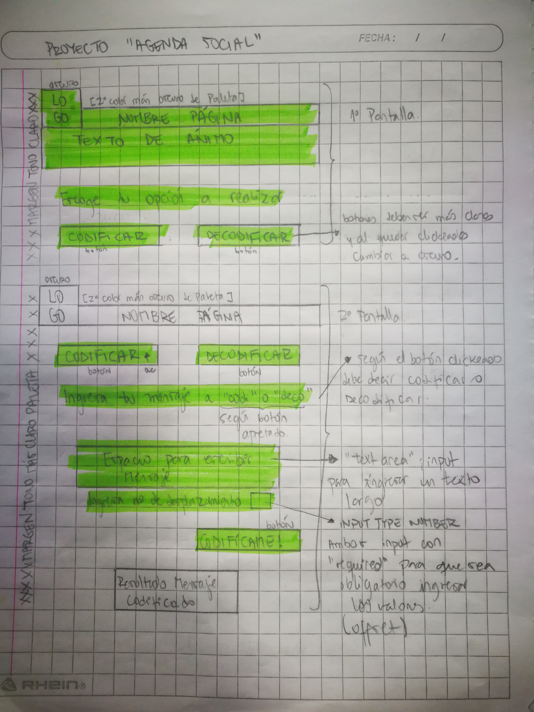
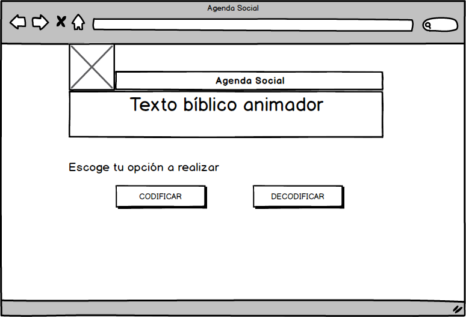
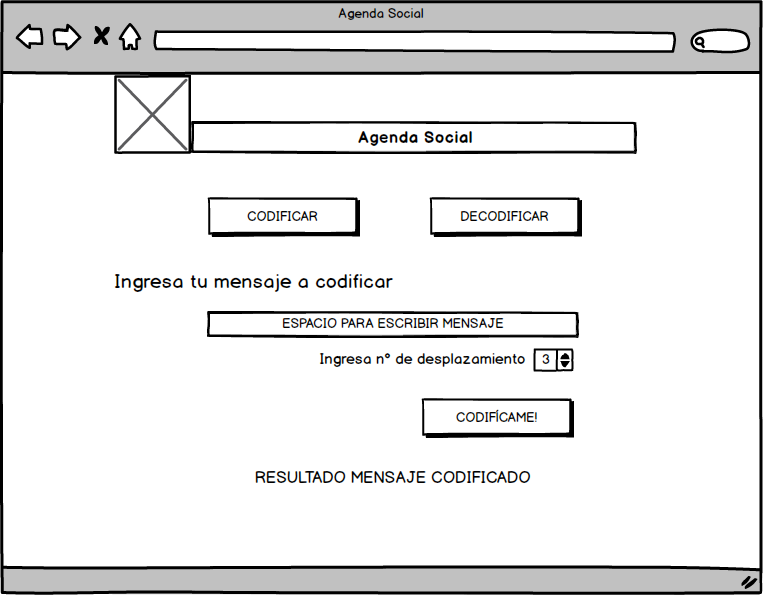
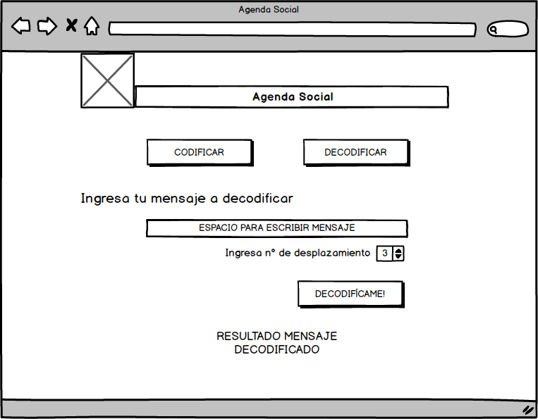
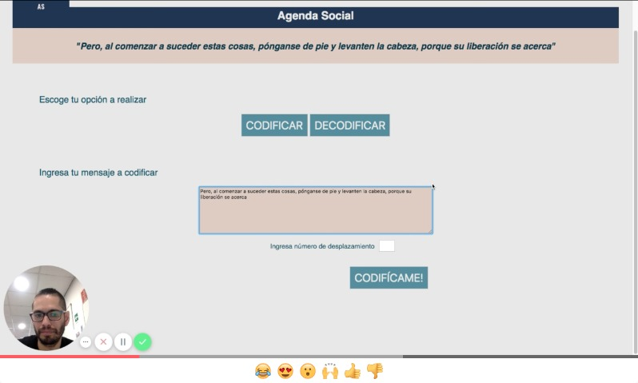
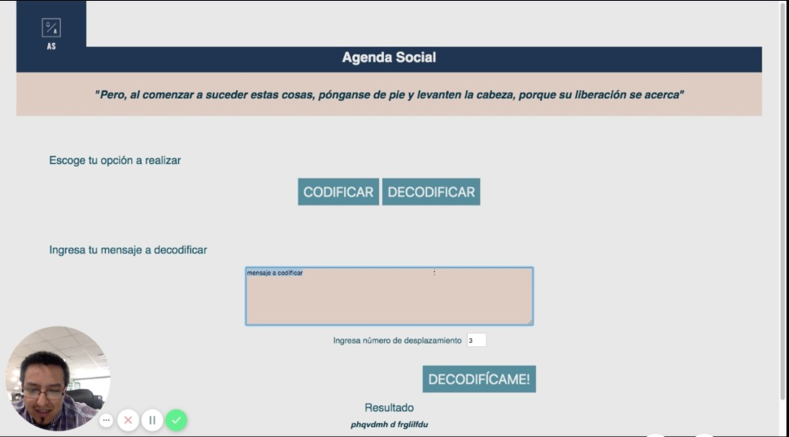
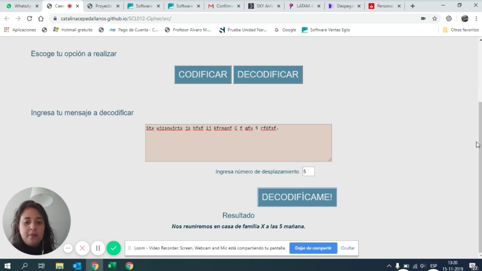
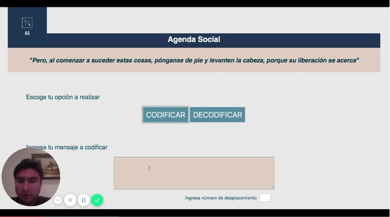
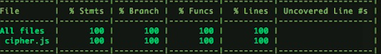
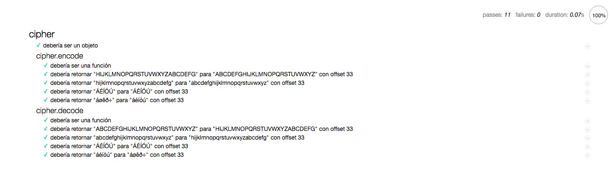

# Proyecto Cifrado César

Este programa permite codificar y decodificar información.

## Creación del Proyecto

Este proyecto fue creado a partir de una necesidad muy específica.

Para comenzar, haré una breve descripción de cómo y porqué escogí el tema del proyecto. Soy Testigo de Jehová (una religión,
tal vez no tan conocida) y como tal, nos congregamos semanalmente en un lugar llamado Salón del Reino.

Esto nace a raíz de que en distintas partes del mundo se viola el derecho (o simplemento no existe) de libertad de culto. Esto implica que los ya mencionados Salones del Reino, son  saqueados, expropiados y hasta destruidos, para poder evitar a toda costa que la gente se siga congregando.

Para nosotros es muy importante el asistir a tales reuniones, por eso se vuelve extremadamente difícil cuando un país lo prohibe. La idea de poder codificar/decodificar un mensaje se vuelve relevante en estas instancias. Ya que se podría utilizar para reunirse en grupos pequeños y en diferentes direcciones para no ser localizados fácilmente.

## Decisiones de diseño

Ya tenía una idea preconcebida de cómo quería que se viese el proyecto, un color primario de entrada y sus derivados, acompañado por colores pasteles. Estudiando el uso de los colores en marketing descubrí que el azul suele vincularse a la serenidad, calma y paz; por eso sería perfecto utilizarlo para una plataforma que fuese usada por personas que se encuentran en incertidumbre y ansiedad por los acontecimientos que están pasando a su alrededor. 
También era importante incoporar un texto que animara a la gente a seguir reuniéndose como era la costumbre antes de que el panorama cambiara en el país al que pertenecen; algo que les siguiera recordando que debían mantenerse enfocados.

El diseño sencillo y sin instrucciones completas, es porque imaginé que al estar prohibida la religión y el congregarse,
debía ser lo menos llamativo posible, para que no sospecharan nada.

#### Bosquejo a mano alzada

#### Sketch usando Balsamiq

## Pruebas en usuarios en reales

Se realizaron pruebas en usuarios reales. Un total de 4 personas, las cuales tuvieron la oportunidad de acceder a la página web e
interactuar en ella. 

Para esto se utilizó un programa llamado Loom para poder grabar, además de la interacción en la pantalla, obtener y capturar las reacciones de los usuario al visitar por primera vez la página web. A continuación adjunto links de los videos ya mencionados.

#### Usuario Real Nº 1

[Video Nº1](https://www.loom.com/share/d2031dbe17be434fb67478a50ab1a29f)

#### Usuario Real Nº 2

[Video Nº2](https://www.loom.com/share/b83bc938c30f4682bde7425466d767d7)

#### Usuario Real Nº 3

[Video Nº3](https://www.loom.com/share/2da7943291394a39bf30d54e58145483)

#### Usuario Real Nº 4

[Video Nº4](https://www.loom.com/share/05a14973d46141d697f00b72730d0586)

Apreciaciones:
- Es muy importante preguntar e informar sobre el sistema operativo que se está utilizando, en mi caso, utilizo MAC y
no todos saben cómo funciona. Por eso, antes de comenzar a realizar los test, hacer una breve introducción a este sistema
operativo para que la interacción en la página sea más amigable.

- El 75% entendió rápidamente el proyecto y su utilización.

- El 25% restante, le costó entender el sistema operativo del computador, lo que dificultó aún más la utilización de la
página. No entendieron bien cómo se "enviaba un mensaje secreto" al principio, por lo que después de un momento tuve que
explicar de lo que trataba, para que pudiera proseguir con el test.

## Imágenes Test Unitarios

## Conclusión del Proyecto

El propósito del proyecto fue crear una página web que fuese capaz de cifrar y descifrar un texto. Para
ello tuvimos que aprender en qué consistía un Cifrado César y a partir de esto, poder generar un formulario
lo más simple y acotado posible, que diera una respuesta rápida.

Mi problemática fue que al ser Testigo de Jehová en algunos países se niega el derecho de libertad de culto;
por ende esta era una buena opción para poder seguir reuniéndonos pero en casas, por lo que el proyecto 
servirá para codificar y decodificar mensajes, tales como: direcciones, lugares de reunión, horarios, etc.

Finalmente, el objetivo se cumple en la página web creada, realiza el cifrado y descifrado del texto ingresado.
Tal vez el diseño escogido es muy sencillo y resta que la expericiencia pueda ser intuitiva, para alguien que no
está tan inmerso en el mundo de la tecnología.

Para terminar, creo que pudo ser mucho más explicativa la página, y haberle sacado más provecho al UX Desing, pero en 
base a mi idea de proyecto necesitaba algo que no llamase la atención y que fuese lo más directo posible; ya que mi 
usuario final sabe para qué sirve y está al tanto que debe pasar desapercibido.
