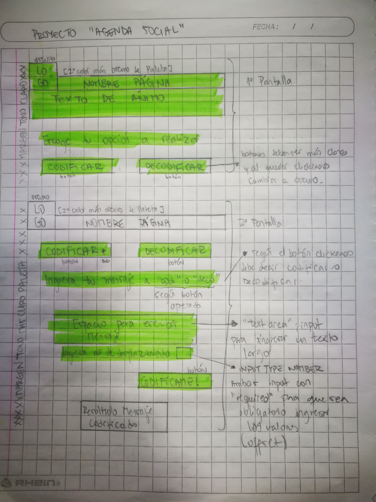
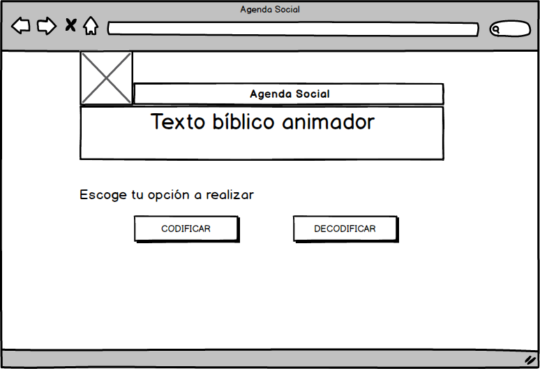
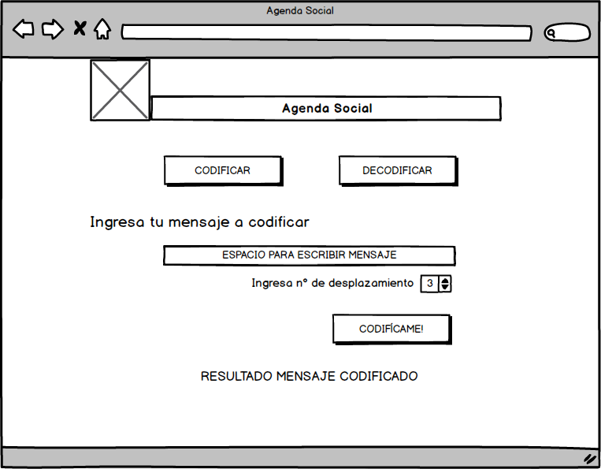
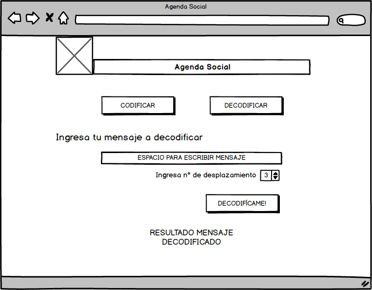

# Proyecto Cifrado César

Este programa permite codificar y decodificar información.

## Creación del Proyecto

Este proyecto fue creado a partir de una necesidad muy específica.

Para comenzar, haré una breve descripción de cómo y porqué escogí el tema del proyecto. Soy Testigo de Jehová (una religión,
tal vez no tan conocida) y como tal, nos congregamos semanalmente en un lugar llamado Salón del Reino.

Esto nace a raíz de que en distintas partes del mundo se viola el derecho (o simplemento no existe) de libertad de culto. Esto implica que los ya mencionados Salones del Reino, son  saqueados, expropiados y hasta destruidos, para poder evitar a toda costa que la gente se siga congregando.

Para nosotros es muy importante el asistir a tales reuniones, por eso se vuelve extremadamente difícil cuando un país lo prohibe. La idea de poder codificar/decodificar un mensaje se vuelve relevante en estas instancias. Ya que se podría utilizar para reunirse en grupos pequeños y en diferentes direcciones para no ser localizados fácilmente.

## Decisiones de diseño

Ya tenía una idea preconcebida de cómo quería que se viese el proyecto, un color primario de entrada y sus derivados, acompañado por colores pasteles. Estudiando el uso de los colores en marketing descubrí que el azul suele vincularse a la serenidad, calma y paz; por eso sería perfecto utilizarlo para una plataforma que fuese usada por personas que se encuentran en incertidumbre y ansiedad por los acontecimientos que están pasando a su alrededor. 
También era importante incoporar un texto que animara a la gente a seguir reuniéndose como era la costumbre antes de que el panorama cambiara en el país al que pertenecen; algo que les siguiera recordando que debían mantenerse enfocados.

#### Bosquejo a mano alzada

#### Sketch usando Balsamiq

